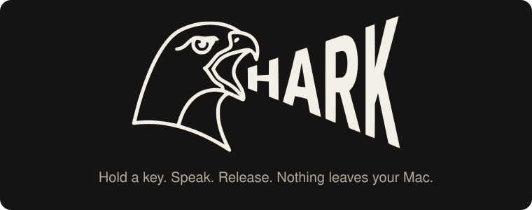

<p align="center">
  <a href="https://harkdictate.com"></a>
</p>

<p align="center">
  <a href="https://harkdictate.com">harkdictate.com</a> ·
  <a href="https://harkdictate.com/download">Download</a> ·
  <a href="docs/brand.md">Brand</a> ·
  <a href="docs/releasing.md">Releasing</a> ·
  <a href="#license">MIT or Apache-2.0</a>
</p>

# Hark

**Hold a key. Speak. Release. Clean text lands wherever your cursor is.**

Hark is dictation and meeting transcription that runs entirely on your Mac.
Speech recognition on the Neural Engine, speaker separation and search in one
local database, and nothing sent anywhere. Not to us, because there is no us
to send it to.

```sh
brew install --cask tjameswilliams/tap/hark
```

Free and open source. macOS 15 or later on Apple Silicon. Or
[download the signed dmg](https://harkdictate.com/download).

## What it does

**Dictation.** Hold right ⌘ and talk. Release, and the transcript is pasted
into whatever field is focused, in any app. Filler words and punctuation are
tidied by a cleanup model you choose, and if that model is slow or down, the
raw transcript pastes instead. It never fails closed.

**Meetings.** Hark captures a meeting's audio straight from Core Audio,
whichever app is running it, then separates the speakers and transcribes it on
your Mac. When the call goes quiet for two minutes it asks whether to stop, then
opens the meeting so you can name it and file it under a project. No bot joins
your call and the recording never goes to a cloud service.

**Knowledge.** Dictations and meetings are embedded and grouped into projects.
Search them by keyword or by meaning, or ask a question and get an answer with
the transcript to back it up.

**Your AI tools.** A small MCP server, `hark-mcp`, lets Claude Code, OpenCode
and Codex search and read your meetings and dictations. Read-only, local,
running only while the tool is asking.

**Dictionary.** Add the people, products and jargon it keeps misspelling.
Terms feed speech recognition, the cleanup model and a final spelling pass.

**Fast because it is local.** NVIDIA's Parakeet TDT v3 runs on the Apple
Neural Engine through Core ML. A ten-second utterance transcribes in about a
tenth of a second, on battery, with the fans off.

## Zero to dictating

1. **Install Hark.** `brew install --cask tjameswilliams/tap/hark`, or drag
   the dmg to Applications. Signed and notarized by Apple.
2. **Grant two permissions.** Microphone, to hear you, and Accessibility, to
   paste where your cursor is. Hark asks for both on first launch and opens the
   right System Settings pane for each. Meeting capture asks for audio
   recording the first time you use it.
3. **Hold the key.** Right ⌘ by default; right ⌥ or right ⌃ if you prefer. A
   rufous pill appears while Hark is listening. Let go and the text arrives.
   Taps shorter than a third of a second are ignored, so the key still works
   in shortcuts.

The first dictation downloads the speech model to your Library folder. After
that Hark works offline.

## For your AI tools

Register the MCP server once per client, from the Settings window or the
terminal. The Homebrew cask puts `hark-mcp` on your PATH.

```sh
hark-mcp install --client claude     # Claude Code
hark-mcp install --client opencode   # OpenCode
hark-mcp install --client codex      # Codex
hark-mcp install --client all
```

Tools: `search_knowledge`, `list_projects`, `list_sessions`,
`get_transcript`, `recent_meetings`. The server opens the database read-only,
speaks MCP over stdio, and exposes nothing to the network.

## What stays on your Mac

Everything, with one exception you control.

- **Audio** is transcribed on the Neural Engine and discarded. A meeting
  recording is kept only if processing fails, so you can retry.
- **Transcripts, embeddings and speaker profiles** live in one SQLite file
  under `~/Library/Application Support/Hark`. Back it up, query it, delete it.
- **The exception:** the cleanup step sends each transcript's text to an
  OpenAI-compatible endpoint of your choosing. Point it at LM Studio or Ollama
  and nothing leaves the machine. Point it at a cloud API and that text does.
  It is off until you turn it on.
- **No telemetry, no crash reporting, no accounts, no update pings.**

The full statement is on the [privacy page](https://harkdictate.com/privacy).

## Against the subscriptions

The paid dictation and meeting tools are good. Most of them are also a monthly
fee for sending your voice to someone else's computer.

| | Hark | Wispr Flow | superwhisper | Granola |
|---|---|---|---|---|
| Price | **Free**, open source | $15/user/month | $849 lifetime headline | $14/user/month past 30 days of history |
| Speech transcribed | **On your Mac, always** | In the cloud, always | On your Mac (Apple Silicon) | Their servers (AWS, US) |
| Transcripts live | **One SQLite file** on your Mac | Wispr's cloud | On your device | Their servers |
| Account required | **No** | Yes | Yes, for a licence | Yes |
| Meetings without a bot | **Yes** | Yes | Yes | Yes |
| Your coding agents can read your notes | **Yes**, local MCP | None listed | None listed | Business plan, via cloud |
| Source you can read | **Yes** | No | No | No |
| iPhone app | Not yet | Yes | Yes | Yes |
| Windows | No | Yes | Yes | Yes |

Read from each vendor's own pricing and privacy pages on 8 September 2026;
the [full table](https://harkdictate.com/#what-the-subscriptions-charge-for)
carries the links. If a cell is out of date,
[open an issue](https://github.com/tjameswilliams/hark/issues).

## How it works

```
┌──────────────────────  Swift: Hark.app (menu bar, LSUIElement)  ──────────────────────┐
│  Push-to-talk (CGEventTap)  ·  Paste injection  ·  Core Audio process taps (meetings) │
│  Core ML inference via FluidAudio: Parakeet TDT v3 on the Neural Engine, diarization   │
│  Settings, knowledge window, listening indicator                                        │
└───────────────────────────────────┬────────────────────────────────────────────────────┘
                                    │ UniFFI, in-process
┌───────────────────────────────────┴────────────  Rust: hark-core  ─────────────────────┐
│  Session orchestration  ·  SQLite (sqlite-vec + FTS5, WAL)  ·  fastembed embeddings     │
│  Speaker-turn chunking  ·  Hybrid search (BM25 + KNN, RRF)  ·  Cleanup client           │
│  Custom dictionary: acoustic biasing, prompt terms, deterministic spelling pass          │
└───────────────────────────────────┬────────────────────────────────────────────────────┘
                                    │ same crate, second binary
                            ┌───────┴────────┐
                            │    hark-mcp    │  stdio MCP server (rmcp), read-only,
                            └────────────────┘  spawned on demand by your AI tool
```

Swift owns the OS surface and the ML inference because the fastest, most
power-efficient speech recognition on Apple Silicon lives behind Core ML and
the Neural Engine. Rust owns the engine because that is where the data model,
the search and the MCP server want to live. The two are linked in one process
through UniFFI. The reasoning, with sources, is in
[docs/SPIKE.md](docs/SPIKE.md).

## Build from source

You need Xcode 16 or later and a Rust toolchain.

```sh
git clone https://github.com/tjameswilliams/hark
cd hark
scripts/build-app.sh      # cargo build, UniFFI bindings, swift build, Hark.app
open build/Hark.app
```

The script signs with a Developer ID if one is in your keychain and falls
back to an ad-hoc signature otherwise. Ad-hoc builds lose their Accessibility
and Microphone grants whenever the binary changes; see the script's notes.
Logs land in `~/Library/Logs/Hark/hark.log`.

## Repository layout

```
apps/Hark          Swift menu-bar app (SwiftPM)
crates/hark-core   Rust engine library
crates/hark-mcp    stdio MCP server binary
website/           harkdictate.com (Astro, S3 + CloudFront via CDK) and the Remotion clips
packaging/         Homebrew cask, source of truth for the tap
tools/mark/        brand asset generator (icns, favicon, share card, banner)
scripts/           build-app.sh, release.sh
docs/              brand and style guide, releasing, the feasibility spike
spikes/            throwaway prototypes that de-risked the OS integration
```

## Brand

Hark is a hawk. The mark is the Call: the outline of a Red-tailed Hawk's head,
beak open, the word HARK issuing from it. The palette, the voice, and the
rules for using them are in [docs/brand.md](docs/brand.md). Source artwork is
in `docs/brand/source/`, and every derived asset is regenerated with
`python3 tools/mark/build-assets.py`.

## Status

Pre-alpha, in daily use by its author. Dictation, meeting capture with
diarization, the knowledge layer and the MCP server all work end to end. The
feasibility spike that shaped the architecture is in
[docs/SPIKE.md](docs/SPIKE.md). Releases are cut with
[scripts/release.sh](scripts/release.sh); see
[docs/releasing.md](docs/releasing.md).

## License

Dual-licensed under either of

- Apache License, Version 2.0 ([LICENSE-APACHE](LICENSE-APACHE))
- MIT license ([LICENSE-MIT](LICENSE-MIT))

at your option. Speech model weights (NVIDIA Parakeet, via FluidInference's
Core ML conversions) are CC-BY-4.0.

Unless you explicitly state otherwise, any contribution intentionally
submitted for inclusion in the work by you, as defined in the Apache-2.0
license, shall be dual licensed as above, without any additional terms or
conditions.
